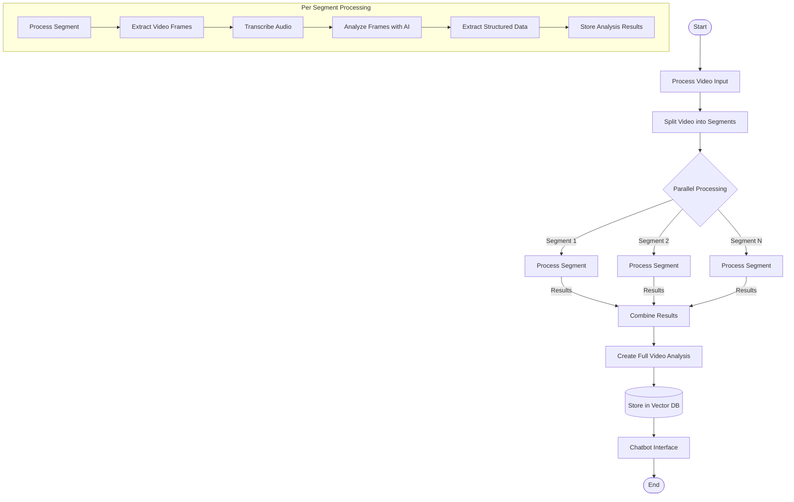
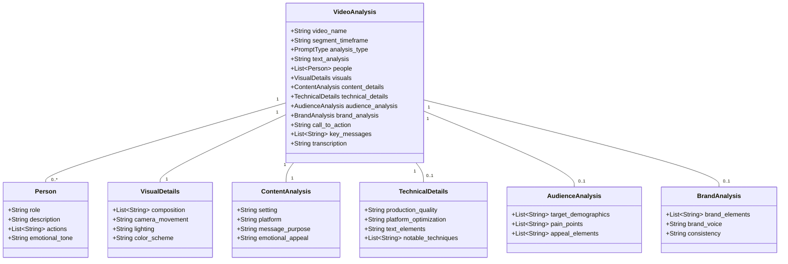
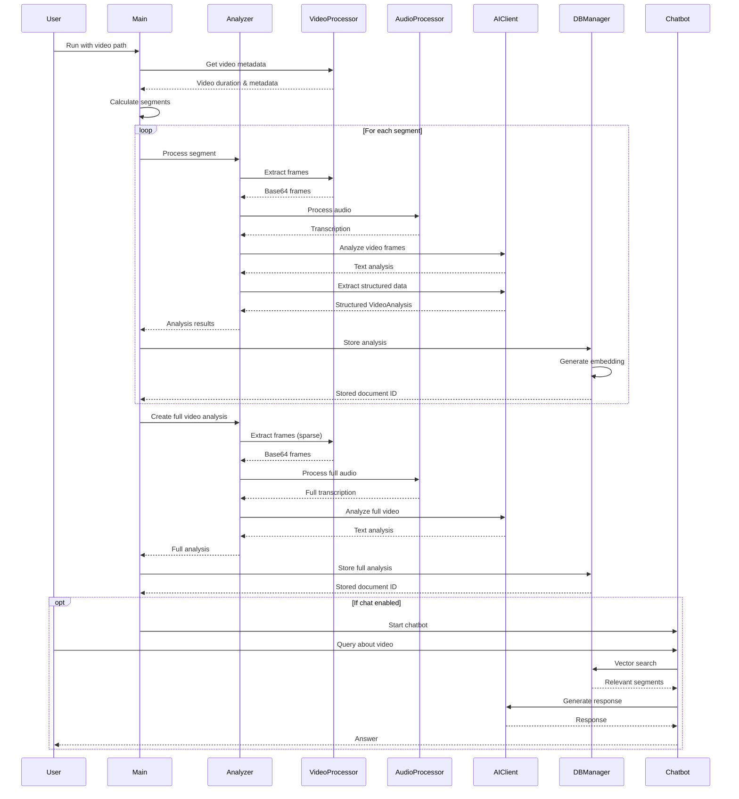
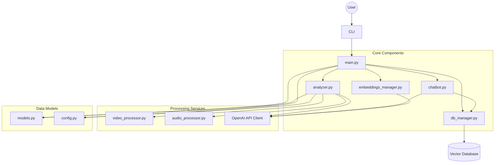
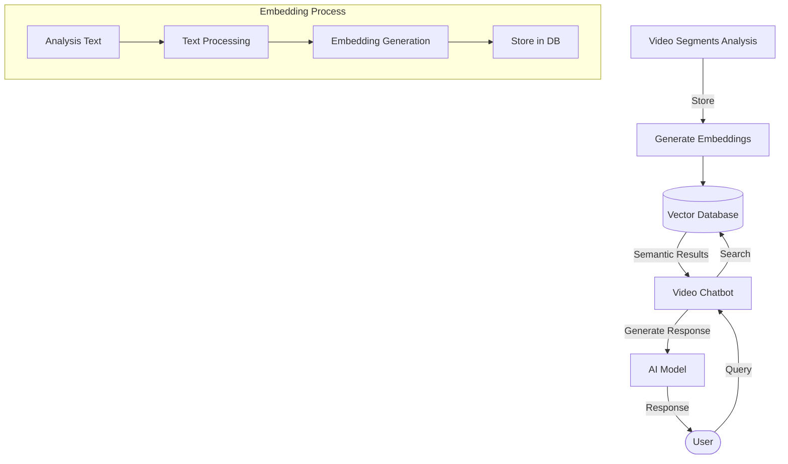
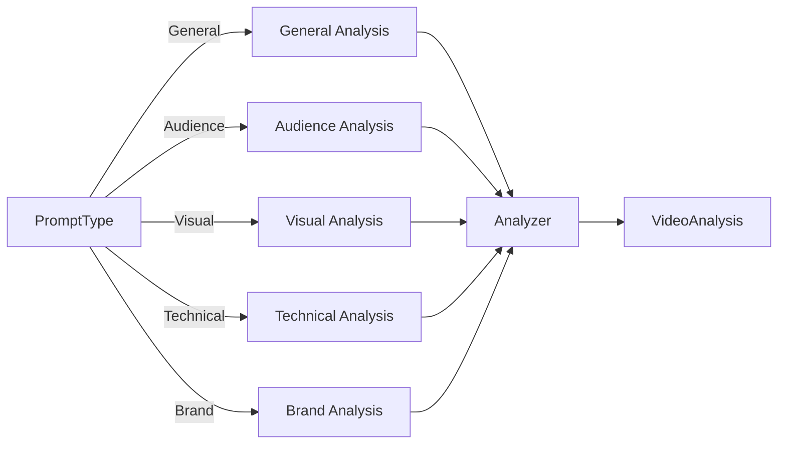

# Chunker Application Business Logic

This document outlines the business logic of the Chunker application, which is designed to process and analyze video content, breaking it down into meaningful segments for detailed analysis.

## Core Workflow

## Data Model

## Analysis Process

## Component Architecture

## Vector Database Flow

## PromptType Enum Flow

